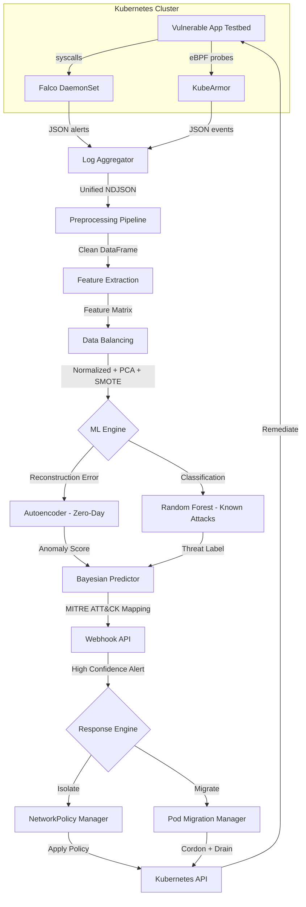
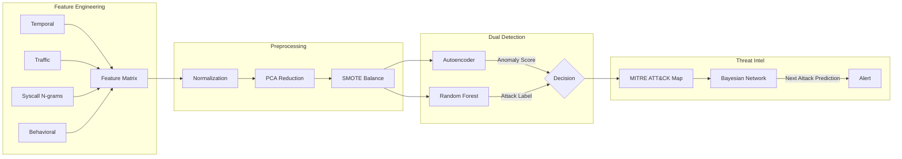
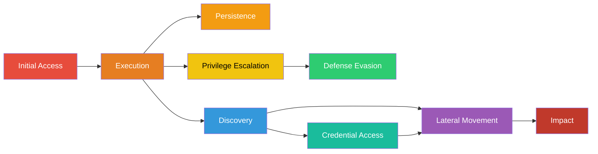

# System Architecture — AIOps Threat Intelligence

## Data Flow Architecture

## Component Interaction Matrix

| Producer → Consumer | Data Format | Protocol |
|---|---|---|
| Falco → Log Aggregator | NDJSON | stdout/file |
| KubeArmor → Log Aggregator | JSON | relay API |
| Log Aggregator → Preprocessing | NDJSON file | filesystem |
| Preprocessing → Feature Extraction | pandas DataFrame | in-memory |
| Feature Extraction → Data Balancing | pandas DataFrame | in-memory |
| Data Balancing → Autoencoder | numpy array | in-memory |
| Data Balancing → Random Forest | numpy array | in-memory |
| ML Engine → Webhook | JSON alert | HTTP POST |
| Webhook → NetworkPolicy Manager | function call | in-process |
| Webhook → Pod Migration Manager | function call | in-process |
| Response Engine → Kubernetes | API objects | K8s REST API |

## ML Pipeline Architecture

## MITRE ATT&CK Kill Chain Mapping

## Response Engine Decision Matrix

| Risk Level | Confidence | Actions |
|---|---|---|
| CRITICAL | ≥0.95 | Isolate pod + Cordon node + Migrate pods |
| HIGH | ≥0.85 | Isolate pod (NetworkPolicy deny-all) |
| MEDIUM | ≥0.70 | Apply audit policy + enhance monitoring |
| LOW | <0.70 | Log alert only |
