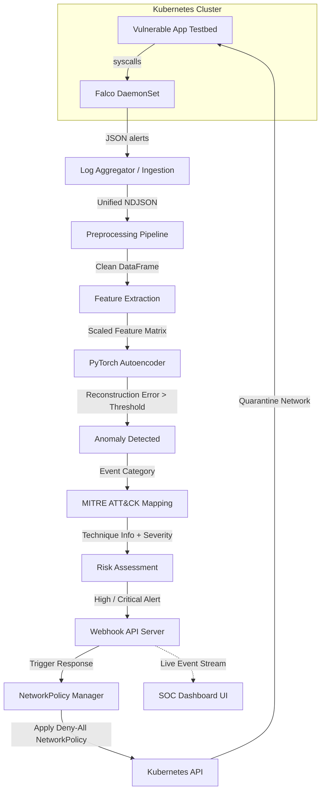
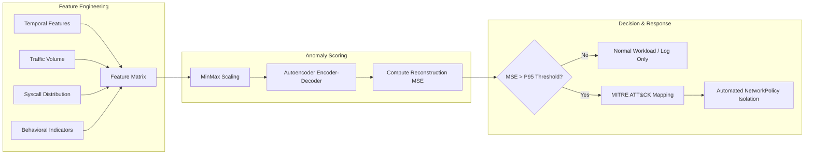

# System Architecture — Kubernetes Runtime Threat Detection

## 1. End-to-End Data Flow Architecture

```mermaid
graph TD
    subgraph Kubernetes Cluster
        VA[Vulnerable App Testbed] -->|syscalls| F[Falco DaemonSet]
    end

    F -->|JSON alerts| LA[Log Aggregator / Ingestion]
    LA -->|Unified NDJSON| PP[Preprocessing Pipeline]

    PP -->|Clean DataFrame| FE[Feature Extraction]
    FE -->|Scaled Feature Matrix| AE[PyTorch Autoencoder]

    AE -->|Reconstruction Error > Threshold| DET[Anomaly Detected]
    DET -->|Event Category| MITRE[MITRE ATT&CK Mapping]
    MITRE -->|Technique Info + Severity| RISK[Risk Assessment]

    RISK -->|High / Critical Alert| WH[Webhook API Server]
    WH -->|Trigger Response| NP[NetworkPolicy Manager]
    NP -->|Apply Deny-All NetworkPolicy| KC[Kubernetes API]
    KC -->|Quarantine Network| VA

    WH -.->|Live Event Stream| DASH[SOC Dashboard UI]
```

## 2. Component Interaction Matrix

| Producer → Consumer | Data Format | Protocol / Mechanism | Description |
|---|---|---|---|
| **Falco → Log Aggregator** | JSON / NDJSON | Stdout / File Tail | Captures runtime syscall events from containers |
| **Log Aggregator → Preprocessing** | NDJSON Stream | Filesystem / In-memory | Normalizes schema and timestamps |
| **Preprocessing → Feature Extraction** | Pandas DataFrame | In-memory | Computes temporal, traffic, syscall, & behavioral features |
| **Feature Extraction → Autoencoder** | Scaled NumPy Array / PyTorch Tensor | In-memory Tensor | Evaluates reconstruction MSE loss against baseline threshold |
| **ML Engine → MITRE Mapping** | Anomaly Event Object | Function Call | Resolves MITRE ATT&CK Container Matrix techniques (e.g., T1611) |
| **ML Engine → Webhook API** | JSON Alert Payload | HTTP POST | Transmits enriched threat alert to response coordinator |
| **Webhook API → NetworkPolicy Manager** | Alert Data Dict | Internal Call | Evaluates risk level and executes policy specification |
| **NetworkPolicy Manager → Kubernetes API** | `V1NetworkPolicy` Object | Kubernetes REST API | Deploys ingress/egress deny rules isolating target pod |
| **Webhook API → Dashboard UI** | JSON REST API | HTTP GET (`/api/v1/history`, `/api/v1/status`) | Real-time visual monitoring for SOC operators |

## 3. Machine Learning Inference Pipeline

```mermaid
graph LR
    subgraph Feature Engineering
        T[Temporal Features] --> FM[Feature Matrix]
        TR[Traffic Volume] --> FM
        SC[Syscall Distribution] --> FM
        BH[Behavioral Indicators] --> FM
    end

    subgraph Anomaly Scoring
        FM --> NORM[MinMax Scaling]
        NORM --> AE[Autoencoder Encoder-Decoder]
        AE --> MSE[Compute Reconstruction MSE]
    end

    subgraph Decision & Response
        MSE --> THRESH{MSE > P95 Threshold?}
        THRESH -->|No| LOG[Normal Workload / Log Only]
        THRESH -->|Yes| MAP[MITRE ATT&CK Mapping]
        MAP --> QUARANTINE[Automated NetworkPolicy Isolation]
    end
```

## 4. Response Engine Decision Protocol

| Anomaly Score / Risk Level | Threshold Multiplier | Action Taken | Rationale |
|---|---|---|---|
| **CRITICAL** | $> 1.5 \times \text{Threshold}$ | Apply Deny-All NetworkPolicy immediately | High-confidence container escape or root exploit in progress |
| **HIGH** | $> 1.0 \times \text{Threshold}$ | Apply Deny-All NetworkPolicy immediately | Significant anomaly (e.g. unauthorized interactive shell, exfiltration) |
| **MEDIUM** | $0.7 - 1.0 \times \text{Threshold}$ | Log alert, monitor entity | Moderate deviation from baseline; avoid false-positive disruption |
| **LOW / NORMAL** | $\le 0.7 \times \text{Threshold}$ | Standard telemetry log | Normal container operational activity |
